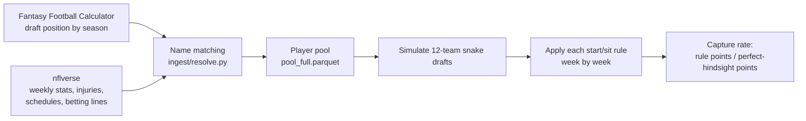

# Fantasy Football Start/Sit Assistant

A weekly lineup helper for fantasy football, plus an honest measurement of how much a tool
like this can possibly be worth.

The eventual product: you give it your roster, it pulls together injuries, matchups,
betting lines, recent form and team news, and recommends a lineup with a reason and a
source for every call.

Right now the repo contains the measurement work (finished) and the first piece of the
tool (a working MCP server with one tool). The rest is planned, not built. See
[Status](#status).

---

## What is this worth? (Read this first)

Most tools in this category imply an edge they never measured. We measured ours before
building it. Twelve seasons, 144 team-seasons, using only information that existed before
each decision was made.

| Who sets the lineup | Points/season | % of the best possible |
|---|---|---|
| Random | 1,521 | 85.1% |
| **A twelve-line rule: season average, nudged toward preseason rank** | **1,631** | **91.2%** |
| A cheater who knows every player's true ability | 1,671 | 93.4% |
| A cheater who also knows every matchup in advance | 1,681 | 94.0% |
| Perfect hindsight (impossible) | 1,789 | 100% |

**A cheater with perfect information beats a simple rule by 49 points a season — about 2.9
points a week out of roughly 96.** 95% confidence interval [44, 54].

The whole weekly decision — the 267 points between a random lineup and a perfect one —
splits three ways:

| | Points | Share |
|---|---|---|
| A simple rule already gets this | 110 | 41% |
| Could be won with better information | **49** | **18%** |
| Week-to-week luck, unwinnable | 108 | 40% |

So **no start/sit tool, this one included, is going to meaningfully out-pick a simple
rule.** What this one does is do twenty minutes of tab-switching for you and show its
sources.

It also can't be validated by using it. Because the per-team-season swing is 38.6 points,
detecting a realistic +15-point system needs about **53 team-seasons**. Playing a live
season gives you **one**.


Every number above is reproducible — see [Reproducing the numbers](#reproducing-the-numbers).
Full write-up with the methodology in [docs/FINDINGS.md](docs/FINDINGS.md).

---

## Status

**Done — the measurement (Step 1).** Data pipeline, ID matching, lineup scoring, and the
three headroom experiments. This is the bulk of the code here.

**Started — the MCP server (Step 2).** One tool works end to end
(`get_player_form`) with a demo client that shows what crosses the wire. Five more tools
planned.

**Not built yet.** News pipeline (Step 3), the LangGraph agent that branches on injury
status (Step 4), deployment (Step 5). The plan for all of it is in [plan.md](plan.md).

**Also not here yet:** no test suite. `pytest` is declared as a dev dependency but no
tests are written. The correctness work so far lives in the gate scripts under
[checks/](checks/), which fail loudly when an assumption breaks.

---

## Getting started

You need Python 3.12+ and [uv](https://docs.astral.sh/uv/). Internet access too — data is
fetched live from nflverse and the Fantasy Football Calculator API; nothing is vendored.

```bash
git clone <this repo>
cd fantasy_draft_eval_project
uv sync
```

### Try the MCP server

MCP (Model Context Protocol) is a standard way to hand an AI a set of functions it can
call. [mcp_server/server.py](mcp_server/server.py) is a minimal one — a single tool that
returns a player's recent games.

Run the server on its own and nothing appears to happen:

```bash
uv run python mcp_server/server.py
```

That's correct. It's a program waiting to be spoken to over stdin. To actually see it
work, run the demo client, which launches the server as a child process and prints the
JSON going back and forth:

```bash
uv run python mcp_server/demo_client.py
```

You'll see five steps: the client asking what tools exist, a successful call, a name that
doesn't exist, a name that matches several players, and an optional argument in use. The
error cases are the interesting ones — see [Design rules](#design-rules-that-earned-their-place).

---

## Reproducing the numbers

Run these in order. The first one builds the player pool everything else reads.
`checks/out/` is deliberately not committed, so a fresh clone rebuilds it.

```bash
# 1. Build the player pool: 12 seasons of draft data, matched to real player IDs
uv run python checks/step1_build_pool.py

# 2. How good are simple start/sit rules?
uv run python checks/step1_baseline.py

# 3. How much of the remaining gap is forecastable rather than luck?
uv run python checks/step1b_ceiling.py

# 4. Is week-specific information (matchups) worth anything?
uv run python checks/step1c_matchup.py

# 5. Redraw the chart above
uv run python checks/plot_step1.py
```

Two more scripts check the data itself rather than producing findings:

```bash
# Does every draft-list name resolve to a real player ID? (hard gate, needs >=99%)
uv run python checks/g2_id_resolution.py
uv run python checks/g2_id_resolution.py --suggest   # propose new name aliases

# Propose aliases from roster evidence instead of string similarity
uv run python checks/g2_verify_aliases.py
```

Each script prints its results to the terminal and writes a `.parquet` to `checks/out/`.
The draft-data steps pause between seasons so the free API isn't hammered, so expect a
minute or two.

---

## What's in here

```
src/ffeval/              The library
  ingest/ids.py          Name normalization + the alias table
  ingest/resolve.py      Draft names -> real player IDs, in two stages
  scoring/league.py      League settings, snake draft pick order
  scoring/lineup.py      Weekly lineup building and season scoring
  models/expected.py     Draft position -> expected points

checks/                  Runnable experiments and data gates (see above)
  out/                   Generated results — not committed, rebuildable

mcp_server/              The tool layer
  server.py              MCP server, one tool so far
  demo_client.py         Talks to it and prints the wire traffic

docs/FINDINGS.md         Every measured number, with the script that produced it
plan.md                  The build plan for what's left
archive/                 Four earlier project directions and why each was dropped
tools/                   Mermaid diagram validator (see tools/README.md)
```

---

## How the data flows



The measurement runs on two free data sources:

- **nflverse** (via `nflreadpy`) — weekly player stats, injuries with practice
  participation, schedules, betting lines, stadium conditions. All 12 seasons of weekly
  stats is 217,490 rows, loads in about 1.6 seconds.
- **Fantasy Football Calculator** — free draft-position data, no API key needed.

Everything is 12-team PPR (one point per catch), positions QB/RB/WR/TE only. Kickers and
defenses are skipped: they're drafted last, close to random, and a team defense joins to
the data differently.

---

## Design rules that earned their place

These aren't style preferences. Each one exists because its absence produced a specific bug.

**Errors are returned, not raised.** An MCP tool that throws gives the AI nothing to act
on. Every failure comes back as a readable value — `{"error": "not_found", ...}` or
`{"error": "ambiguous", "candidates": [...]}` — so the model can pick a different move.

**Every answer carries `source` and `as_of`.** A stale answer should be visible, not
silent. This is also what lets the eventual agent cite where a claim came from.

**Availability and lookup failure are counted separately.** If a name doesn't resolve to a
player ID, that's a bug. If it resolves but the player recorded no games, that's usually
the truth — Le'Veon Bell held out all of 2018. The first version of the gate treated both
as failures, which made it impossible to pass.

**Never add a name alias from memory.** A wrong alias credits one player's season to
another, which is worse than leaving the row unmatched. Every entry in the alias table was
proposed by [checks/g2_verify_aliases.py](checks/g2_verify_aliases.py) from
team/season/position roster evidence. That's how "Hollywood Brown" was confirmed as
Marquise Brown — no string-similarity check will ever find that one.

**Both lineup rules are always computed.** Scoring a roster with perfect weekly hindsight
inflates the result by about 15.6%, and the inflation grows with how volatile the players
are. Since volatility is exactly what strategies differ on, reporting only the hindsight
number would bias any comparison.

**Draft-time and game-time information are not interchangeable.** Betting lines are set
right before kickoff. Using them in a preseason draft model is cheating; using them for a
Sunday-morning lineup call is completely fine. The 2009 draft data on FFC was actually
collected in *June 2010* — ten months after that season ended. Every season's draft window
is now verified to close before Week 1 kickoff. All 12 pass, but 2015 clears by a single
day, which is why it's checked rather than assumed.

---

## Two bugs worth knowing about

Both would have produced plausible wrong answers rather than crashing, which is the
dangerous kind.

**81 swapped players.** Stripping name suffixes maps "Frank Gore Jr." and "Frank Gore" to
the same key. The first version silently kept whichever row came first, crediting a
Hall-of-Fame running back's season to his son. It happened 81 times across different
players. Fixed by breaking ties on who actually recorded snaps that season.

**A ranking that looked good and was useless.** Ranking players by last season's points
scores *better* than real draft consensus when you pool all positions together — a textbook
case of Simpson's paradox, since quarterbacks average 252 points against tight ends at 147,
so raw-points ranking inherits the position ordering for free. Checking what that "winning"
baseline would actually draft: **nine quarterbacks in the first fifteen picks of 2022.** You
can start one. The lesson stuck: correlation with realized points cannot evaluate a draft
strategy, because correlation is blind to roster constraints.

---

## The thing this project is actually about

Four earlier directions for this project died before any of them was built, all of them
visible in an hour of checking rather than a day of coding. They're in
[archive/](archive/) with the reasoning.

What killed them was four questions worth asking before starting any evaluation project:

1. Do you learn the right answer quickly and unambiguously?
2. How many **independent** observations do you get?
3. Is the baseline you're trying to beat actually bad?
4. Is the effect big compared to the noise?

Fantasy football fails 2, 3 and 4. Twelve seasons is twelve independent draws. Draft
consensus is already good. And the effects are a few points against a 180-point spread.

That's why this repo leads with what the tool *can't* do. Measuring the ceiling first is
what turned four months of waiting for a live season into a paragraph.

---

## What's next

| Step | What | Rough time |
|---|---|---|
| 2 | Five more MCP tools: injuries, matchups, defense-vs-position, byes, lineup builder | 1–2 days |
| 3 | News pipeline — pull, chunk and embed team news so it's searchable by meaning | 2–3 days |
| 4 | LangGraph agent that branches on injury status and reads news when it matters | 2 days |
| 5 | Deploy, and write the honest README (this one) | 1 day |

Step 3 is the risky one. Feeds die and sites change, so it's built to degrade to "no news
found" out loud rather than invent something. Step 4's real risk is an agent that sounds
confident while being wrong — the mitigation is that every claim cites a source, and "I
couldn't find anything" is a valid, visible answer.

Details for each in [plan.md](plan.md).

---

## License

None specified yet.
