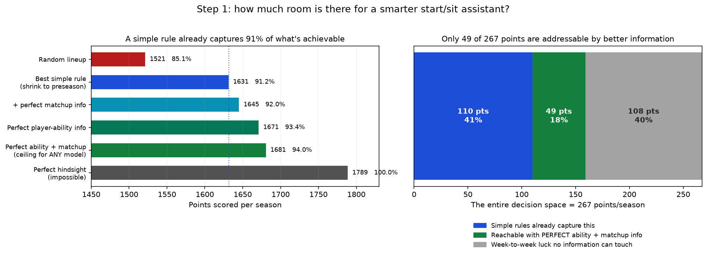
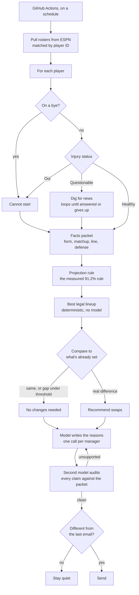
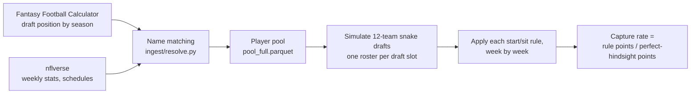

# Fantasy Football: How Much Room Is There for a Smarter Start/Sit Tool?

This project set out to build a weekly lineup assistant. Before building it, we measured
how much such a tool could possibly be worth.

The answer turned out to be the interesting part. So this repo is two things: a
reproducible measurement of the ceiling on fantasy start/sit advice, and an assistant built
strictly inside what that measurement permits it to claim.

Twelve seasons, 144 team-seasons, using only information that existed at the moment each
decision was made.

---

## The finding

| Who sets the lineup | Points/season | % of the best possible |
|---|---|---|
| Random | 1,521 | 85.1% |
| **A twelve-line rule: season average, nudged toward preseason rank** | **1,631** | **91.2%** |
| That rule + perfect knowledge of every matchup | 1,645 | 92.0% |
| A cheater who knows every player's true ability | 1,671 | 93.4% |
| A cheater who knows true ability **and** every matchup | 1,681 | 94.0% |
| Perfect hindsight (impossible) | 1,789 | 100% |

**A cheater with perfect information beats a simple rule by 49 points a season — about
2.9 points a week out of roughly 96.** 95% confidence interval [44, 54], bootstrapped
season by season.

The full weekly decision — the 267 points between a random lineup and a perfect one —
splits three ways:

| | Points | Share |
|---|---|---|
| A simple rule already captures this | 110 | 41% |
| Winnable with better information | **49** | **18%** |
| Week-to-week luck, unwinnable by anyone | 108 | 40% |



### Three things fall out of this

**No start/sit tool can meaningfully out-pick a simple rule.** Not this one, not the
commercial ones. The room simply isn't there. A tool in this category can still be useful
by assembling information and showing its sources — it just can't claim an edge.

**Chasing last week's performance is worse than ignoring everything.** All six rules land
within 35 points of each other, and the recency rule finishes last:

| Rule | Captured |
|---|---|
| Shrink toward preseason rank | 91.2% |
| Season average | 91.0% |
| 50/50 blend of the two below | 90.9% |
| Last 3 games | 90.6% |
| Preseason draft position only, never updated | 90.0% |
| Last 1 game | 89.3% |

Ignoring in-season data completely costs only 23 points a season.

**A tool like this can't be validated by using it.** The per-team-season swing is 38.6
points, so:

| To detect | Team-seasons needed |
|---|---|
| Perfect information (+49) | 5 |
| A very good system (+25) | 19 |
| A realistic system (+15) | **53** |

Playing one live season gives you **one**. So no amount of "I used it and it worked" —
or didn't — settles anything.

Every number above is reproducible. See [Reproducing the numbers](#reproducing-the-numbers).
The full write-up, with each claim tied to the script that produced it, is in
[docs/FINDINGS.md](docs/FINDINGS.md).

---

## What gets built on top, and the one thing it does claim

The measurement above says the lineup advice can't be validated. That is not the same as
saying nothing here can be.

The tool emails each manager in a league a recommended lineup with a reason for every call.
Two claims are available to it, and only one of them is measurable:

**Not claimed: better picks.** Settled above. The tool assembles information and shows its
work; it does not out-pick a simple rule, and any version that implies otherwise is
overselling.

**Claimed, and measurable: the reasons don't make things up.** An assistant that sounds
confident while being wrong is the actual risk of this design, and unlike lineup quality,
this one has cheap ground truth — the facts the model was handed. So a second model
audits every sentence against that packet, and anything it can't ground gets rewritten.

Run the same four questions from [the bottom of this README](#the-thing-this-project-is-actually-about) on
each target, and they come apart cleanly:

| | Is the lineup advice good? | Did it make that sentence up? |
|---|---|---|
| Ground truth arrives | after a season | immediately |
| Independent observations | 144 team-seasons in all of history; a live season gives 1 | hundreds of claims per week |
| Baseline bad enough to beat | no — a simple rule captures 91.2% | expected yes, on a 31B model |
| Effect vs. noise | needs ~53 team-seasons | a few hundred labels |

The unit of evaluation changed from team-seasons to claims, and claims are the one thing
this domain has in abundance.

**Status: not yet measured.** The number goes here once it exists — hand-labelled claims,
unsupported rate with the auditor off and on. Until then this README makes no claim about
it, which is the same standard applied to everything above.

### Not everything needs an AI

The lineup itself is decided by code that already exists and is already measured
([scoring/lineup.py](src/ffeval/scoring/lineup.py), [models/expected.py](src/ffeval/models/expected.py)).
The graph's branching is plain Python. A model is called twice at the end — once to write
the reasons, once to audit them — and it never sets a lineup.

That is a deliberate choice rather than a shortcut, and the measurement is what justifies
it: with a twelve-line rule at 91.2% and an omniscient cheater at 94.0%, there is nothing
for open-ended exploration to find in the decision itself. Where there genuinely *is*
something to find — chasing down what happened to a questionable player this week — the
steps can't be written in advance, so that part loops until it has an answer or gives up.

**"No changes needed" is a first-class output.** Three separate cases produce it: the
recommendation matches what's already set, the gap is smaller than the noise the
measurement quantified, or nothing has changed since the last email — in which case
nothing is sent at all. A tool with no engagement metric can afford to stay quiet, and
most weeks it should.

### How a weekly run works



---

## What's in here

**The measurement, finished.** A data pipeline that matches draft-market data to real
player IDs, a draft simulator, a weekly lineup scorer, and three experiments that bracket
the headroom from below (simple rules) and above (cheating oracles).

**A small reusable library** under [src/ffeval/](src/ffeval/) — league settings, snake
draft order, lineup construction, name resolution, and a draft-position-to-points curve.

**Two data gates** that fail loudly when an assumption breaks, one of which exits
non-zero and works as a pre-commit or CI check.

**An MCP server** under [mcp_server/](mcp_server/) exposing player form, with a client that
prints what crosses the wire. It's a side door, not part of the pipeline — useful if
someone wants to query this from an AI host directly.

**No test suite yet.** `pytest` is declared as a dev dependency but no tests are written.
The correctness work so far lives in those gate scripts.

**The weekly assistant is not built yet.** Its shape is settled — see
[Build status](#build-status) — but the roster fetch, the news search, the model calls, the
auditor and the email delivery are all still to come.

---

## Getting started

You need Python 3.12+ and [uv](https://docs.astral.sh/uv/), plus internet access. Data is
fetched live from nflverse and the Fantasy Football Calculator API; nothing is vendored.

```bash
git clone <this repo>
cd fantasy_draft_eval_project
uv sync
```

## Reproducing the numbers

Run these in order. The first builds the player pool that everything else reads.
`checks/out/` is deliberately not committed, so a fresh clone rebuilds it.

```bash
# 1. Build the player pool: 12 seasons of draft data matched to real player IDs
uv run python checks/step1_build_pool.py

# 2. How good are simple start/sit rules?
uv run python checks/step1_baseline.py

# 3. How much of the remaining gap is forecastable rather than luck?
uv run python checks/step1b_ceiling.py

# 4. Is week-specific information (matchups) worth anything?
uv run python checks/step1c_matchup.py

# 5. Redraw the chart above
uv run python checks/plot_step1.py
```

Each prints its results to the terminal and writes a `.parquet` into `checks/out/`.
The steps that fetch draft data pause between seasons so the free API isn't hammered, so
expect a minute or two.

### The data gates

These check the data itself rather than producing findings:

```bash
# Does every draft-list name resolve to a real player ID?
# Hard gate at 99% — exits non-zero below that, so it works in CI.
uv run python checks/g2_id_resolution.py
uv run python checks/g2_id_resolution.py --suggest   # also propose new name aliases

# Propose aliases from roster evidence instead of string similarity
uv run python checks/g2_verify_aliases.py
```

The first reports two separate numbers, because only one of them is a bug — see
[Design rules](#design-rules-that-earned-their-place).

### The MCP server

```bash
uv run python mcp_server/demo_client.py
```

Launches the server as a child process and walks through tool discovery, a real call, a
missing player, an ambiguous name, and an optional argument — printing the JSON at each
step. There is no AI involved; it's a program exchanging JSON with another program, which
is all MCP ever is.

---

## Repo map

```
src/ffeval/              The library
  ingest/ids.py          Name normalization, the alias table, team abbreviation fixes
  ingest/resolve.py      Draft names -> real player IDs, in two stages
  scoring/league.py      League settings, snake draft pick order
  scoring/lineup.py      Weekly lineup building and season scoring
  models/expected.py     Draft position -> expected points, fit leave-one-season-out

checks/                  Runnable experiments and data gates (see above)
  out/                   Generated results — not committed, always rebuildable

mcp_server/              MCP server and a client that prints the wire traffic

docs/FINDINGS.md         Every measured number, with the script that produced it
docs/step1_headroom.png  The chart above (tracked, because it backs a claim)

plan.md                  Build plan for the weekly tool — STALE, predates the current design
archive/                 Four earlier project directions and why each was dropped
tools/                   Mermaid diagram validator (see tools/README.md)
```

## How the data flows



The key measure is **capture rate**: what a rule scored, divided by what a perfect
hindsight lineup would have scored from the same roster. It's bounded and readable — 100%
means you started exactly the right players every week, and random filling is the floor.

Everything is 12-team PPR (one point per catch), 12 rounds, positions QB/RB/WR/TE, with
7 starters a week (1 QB, 2 RB, 2 WR, 1 TE, 1 FLEX). Kickers and team defenses are left
out: they're drafted last, close to random, and a team defense joins to the data
differently.

---

## Design rules that earned their place

None of these are style preferences. Each exists because its absence produced a specific
wrong answer, or because a measurement ruled the alternative out.

**Lookup failure and real absence are counted separately.** If a draft-list name doesn't
resolve to a player ID, that's a bug — we lost a real player. If it resolves but the
player recorded no games, that's usually the truth: Le'Veon Bell held out all of 2018,
Ray Rice and Josh Gordon were suspended, others got hurt in preseason. The first version
of the gate treated both as failures, which made it impossible to pass. Now the join rate
carries the hard threshold and the play rate is reported for information.

**Never add a name alias from memory.** A wrong alias credits one player's season to
another, which is worse than leaving the row unmatched. Every entry in the alias table was
proposed by [checks/g2_verify_aliases.py](checks/g2_verify_aliases.py), which asks a much
stronger question than "which name looks similar?" — *who actually played that position,
for that team, in that season, and isn't already claimed by another draft row?* That's how
"Hollywood Brown" was confirmed as Marquise Brown: four seasons of support averaging 175.5
points against a next-best two at 89.8, and a team path of BAL→BAL→ARI→ARI→KC that traces
his real career. No string-similarity check will ever find that one.

**Position is deliberately not part of the join key.** Sources disagree — Cordarrelle
Patterson is a receiver to one and a running back to the other in some years — and a
position mismatch would silently drop a real player.

**Both lineup rules are always computed.** Scoring a roster with perfect weekly hindsight
inflates the result, and the inflation grows with how volatile the players are. Two
coin-flip players scoring 5 or 25: committing in advance averages 15, always starting the
one who boomed averages 20. On a real 2019 roster the gap was 1,422 versus 1,644 — a
**15.6% premium no real manager can earn.** Since volatility is exactly what strategies
differ on, reporting only the hindsight number would bias every comparison.

**The expected-points curve is fit leave-one-season-out.** Mapping draft position to
points is a fitted model, not a lookup table. Including the target season would leak that
season's outcome into its own projection.

**That curve is forced to never rise with a later pick.** Single draft ranks are noisy
across ~11 seasons, so the curve gets a rolling mean over neighbouring ranks and then a
running minimum. Monotonicity is the one thing we know a priori must hold.

**No arbitrary cap on pool size.** An early version cut each season's pool at the top 150
players — our choice, not the data's. Start/sit needs bench depth, or every rule gets
forced into identical lineups and the comparison measures nothing. Real pool depth runs
from 146 players (2022) to 206 (2025).

**Draft-time and game-time information are not interchangeable.** Betting lines are set
right before kickoff: using them in a preseason draft model is cheating, while using them
for a Sunday-morning lineup call is completely fine. The 2009 draft data on this API was
actually collected in **June 2010**, ten months after that season ended — using it as
"draft-time consensus" would have been catastrophic. Every season's draft window is now
verified to close before Week 1 kickoff. All 12 pass, but 2015 clears by a single day,
which is why it's checked rather than assumed.

### Rules the assistant design inherits

**A workflow, not an agent — and the number says so.** The branching is Python; the model
doesn't choose which data to fetch. With a twelve-line rule at 91.2% and an omniscient
cheater at 94.0%, the decision is nearly saturated, so there is nothing for model-driven
exploration to discover. The genuinely open-ended part is finding out what happened to a
player this week, and that part does loop.

**The model never sets the lineup.** [best_lineup()](src/ffeval/scoring/lineup.py) is
provably optimal given projections and already measured. The model writes prose. If it
disagrees it can say so in a sentence; it cannot change the answer. That keeps the
recommendation auditable and puts a hard ceiling on what a hallucination can cost.

**Free text annotates; structured data decides.** News fetched from the open web is
untrusted input that ends up in mail sent to other people. So a projection may only move
on a structured field — nflverse ruling a starter out — never on an article's prose. A page
crafted to manipulate the model can add a misleading sentence, which is visible and
fixable. It cannot produce a wrong lineup.

**Nothing personal goes into a prompt.** Gemma runs on Google's free tier, whose terms are
explicit: content is used to improve their products and human reviewers may read it, and
there is no paid tier for these models to upgrade into. So names and email addresses never
enter a prompt. The model sees an anonymous roster; the email is assembled in our own code.

**A different model does the auditing.** A model grading its own output is soft on itself.
The writer and the auditor are deliberately different models, which costs nothing on a free
tier and removes a shared blind spot.

**"I couldn't find anything" is a valid, visible answer,** and there is always a plain
statistical fallback, so the tool still works when the clever parts are down.

---

## Two bugs worth knowing about

Both would have produced plausible wrong answers rather than crashing, which is the
dangerous kind.

**81 swapped players.** Stripping name suffixes maps "Frank Gore Jr." and "Frank Gore" to
the same key. The first version silently kept whichever row came first, crediting a
Hall-of-Fame running back's season to his son. It happened 81 times across different
players. Fixed by breaking ties on who actually recorded snaps in that season.

**A ranking that looked good and was useless.** Ranking players by last season's points
appears to beat real draft-market consensus — 0.528 correlation against 0.375 — when you
pool all positions together. That's Simpson's paradox: quarterbacks average 252 points
against tight ends at 147, so ranking everyone by raw points inherits the position
ordering for free, while the draft market deliberately deviates from raw points to price
scarcity. Compared *within* position, consensus wins 0.634 to 0.528 and takes all 12
seasons.

Then checking what that "winning" baseline would actually draft: **nine quarterbacks in
the first fifteen picks of 2022.** You can start one.

The lesson stuck. Correlation with realized points cannot evaluate a draft strategy,
because correlation is blind to roster constraints.

---

## Data sources

**nflverse**, via `nflreadpy` 0.1.5 — weekly player stats, injuries with practice
participation, schedules, betting lines, stadium conditions and coaches. All 12 seasons of
weekly stats is 217,490 rows and 155 MB, loading in about 1.6 seconds at 223 MB peak
memory. It's pre-aggregated, so play-by-play is never needed, which removes all memory
pressure on a small machine.

One subtlety that carries real signal: **a row exists only if the player was active.** No
row means a bye or inactive; a row scoring 0.0 means he played and did nothing.

**Fantasy Football Calculator** — free draft-position data, no API key. Returns average
draft position, its spread, high and low picks, times drafted, plus a metadata block giving
the draft window, which is what makes the timing check above possible.

**ESPN** — league rosters, for the live tool. Joined by ESPN player ID rather than by name:
every active skill player carries one, so the name-matching machinery above isn't needed
here. One league member's credentials read every team in that league, which is why nobody
is ever asked to hand over their own.

## Stack, for the live tool

| Piece | Choice | Why |
|---|---|---|
| Data | nflverse via `nflreadpy` | Already verified; see above |
| Rosters | ESPN | Where the league actually lives |
| Orchestration | LangGraph | Real branching on injury status, with failure paths |
| Writer model | Gemma 4 31B (`gemma-4-31b-it`) | Free tier, hosted, 256K context |
| Auditor model | A different hosted model | A writer shouldn't grade itself |
| News | Fetch known sources, search the tail | Documents live five days; nothing to index |
| Email | Resend | Hosts the unsubscribe page, so nothing of ours needs to run |
| Schedule | GitHub Actions cron | No server, no idle cost |

**No vector database.** It was in the original design and got cut: a vector store earns its
place on a corpus you query repeatedly, and fantasy news has a five-day shelf life. Nobody
ever asks about last Wednesday's practice report again.

**No web server.** Cron sends the mail and Resend hosts the preference page, so there is
nothing to keep running and nothing to keep patched.

---

## The thing this project is actually about

Four earlier directions for this project were dropped before any of them was built, each
visible in an hour of checking rather than a day of coding. They're in
[archive/](archive/) with the reasoning intact.

What killed them was four questions worth asking before starting any evaluation project:

1. Do you learn the right answer quickly and unambiguously?
2. How many **independent** observations do you get?
3. Is the baseline you're trying to beat actually bad?
4. Is the effect big compared to the noise?

Fantasy football fails 2, 3 and 4. Twelve seasons is twelve independent draws. The draft
market is already good, and doing real work — it beats the naive baseline in all 12
seasons. And the effects are a few points against a 180-point spread.

That's why this repo leads with what a tool here *can't* do. Measuring the ceiling first
turned four months of waiting on a live season into a paragraph.

The same four questions then did something more useful than killing ideas: applied to the
assistant's output rather than its picks, they found the one claim here that *is* testable.
That's the auditor, and it's why it's the first thing being built.

---

## Build status

The measurement is done and doesn't need revisiting. What it fixes is what the assistant
may and may not claim, and that part is settled too.

| | State |
|---|---|
| Ceiling measurement | done |
| Data pipeline, ID resolution, gates | done |
| Projection rule, lineup builder | done |
| MCP server (side door) | done, minimal |
| Facts packet | not started |
| Claim auditor + its evaluation | not started — **next** |
| News search and the digging loop | not started |
| ESPN roster fetch | not started |
| Email, change-gating, cron | not started |

**Next up is the auditor**, before any of the plumbing. It's the only piece here that
produces a number, and it can be built against hand-written facts packets — no roster
fetch, no search, no email, no cron. If it turns out not to help, that's worth knowing in
week one rather than week four.

[plan.md](plan.md) is stale: it predates these decisions and still describes a vector
store, a web server and a model that picks its own tools. Read this file instead until
it's rewritten.

Scope creep back toward proving it out-picks a simple rule is the standing risk. It
doesn't. That's settled, it's at the top of this README, and it isn't worth re-litigating
with more compute.

---

## License

None specified yet.
