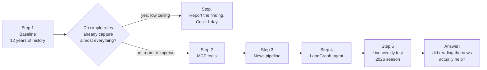
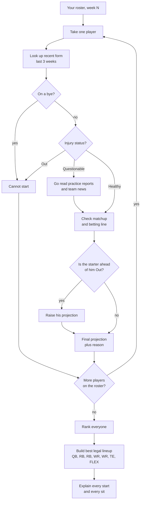
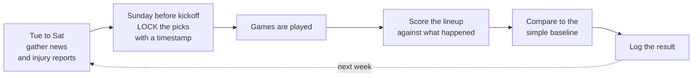
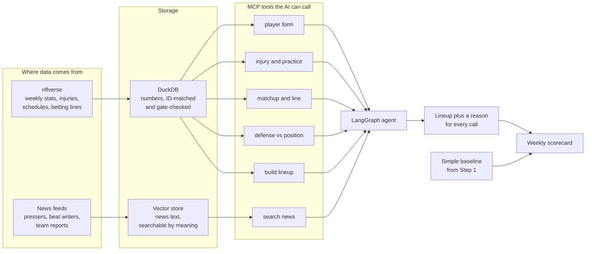

# Weekly Start/Sit Assistant — Simple Plan

## What we're building

A tool that looks at your fantasy roster each week and tells you who to start.

And — more important — **proof that it's actually better than a simple rule.** Nobody in
this space bothers to prove that. That's the whole point of the project.

## Why this works better than the draft project

We spent today learning that drafting is a hard thing to study. Season outcomes are
mostly luck, and twelve seasons isn't much to go on.

Start/sit is friendlier:

| | Drafting | Start/sit |
|---|---|---|
| How far ahead you predict | 4 months | 4 days |
| Decisions you can grade | 12 drafts a year | ~100 lineup calls a year |
| Can the AI cheat by remembering? | Yes, if you test on old seasons | **No** — we test on games that haven't happened |

That last row is the big one. An AI has memorized the 2021 season. Ask it about 2021 and
it isn't predicting, it's remembering. But it can't remember next Sunday.

**The 2026 season starts September 9th.** Ten days away.

## The five steps

The important feature of this order is the **gate after Step 1**. If simple rules already
capture nearly all the available points, there is no room for an AI to help, and we stop
and report that instead of building four more things.

### Step 1 — Build the boring baseline (do this first)

Write a dumb rule and see how well it does. For example: *"start whoever has scored the
most per game over the last three weeks."*

Test it against twelve years of real results. Try a few variations:

- start by season average so far
- start by last three weeks
- start by where they were drafted
- start by a blend of those

Out comes a number: **"the best simple rule captures X% of the points you could have
scored."**

That number is the bar. Without it, "our AI is good" means nothing. We can build this
today with the data already loaded.

### Step 2 — Wrap the data in tools the AI can use

This is the MCP part. MCP is just a standard way to hand an AI a set of functions it can
call. We build six:

- how has this player been doing lately?
- is he hurt, and did he practice this week?
- who is he playing, and is the game expected to be high-scoring?
- how good is that defense against his position?
- who's on a bye?
- given my projections, what's my best legal lineup?

Every one of these is backed by data we already have and already checked.

### Step 3 — Feed it the news (the hard part)

Everything in Step 2 is numbers. Numbers are the part a plain spreadsheet already does
well.

**The only reason to use an AI is the stuff that isn't numbers:**

- "the coach said Wednesday the rookie is getting more carries"
- "the cornerback covering him is out, so this is a good matchup"
- "he's been limited in practice all week"

None of that lives in any stats table. We have to go get it — injury reports, team news,
beat writers. Then store it so the AI can search it by meaning, not just keywords. That's
what the vector database is for.

**This is the riskiest step and the one that justifies the whole project.** Skip it and
we've built a spreadsheet with a chatbot on top, and the AI adds nothing we can measure.

### Step 4 — Chain it together

This is the LangGraph part. LangGraph runs a series of steps where later steps can depend
on what earlier ones found. For each player on your roster:

The branches are the reason this needs LangGraph rather than a fixed sequence of calls.
"Questionable" sends it off to read news that a healthy player never triggers, and finding
out the starter ahead of someone is Out changes that player's value retroactively.

Then set the lineup and explain each call in plain English.

### Step 5 — The honest test

Every week of the 2026 season:

1. **Before kickoff**, the agent writes down its lineup and saves it with a timestamp.
2. After the games, we score it against what actually happened.
3. We compare it to the boring baseline from Step 1.

Because the picks are locked before the games, there is no way to cheat. This is the
thing that makes the project credible instead of a demo.

## How the pieces fit together

Everything in the **Storage** box already exists and is checked, except the vector store.
That is the only new plumbing, and it holds the one thing that justifies using an AI at
all.

## One important detail about grading

Most weeks, the right answer is obvious. You start your best players. If we grade every
decision, the agent and the dumb rule will look almost identical — because they agree on
the easy 90%.

So we grade the **close calls** separately: the weeks where two players were genuinely
hard to choose between. That's where an assistant either earns its keep or doesn't.

## What "good" looks like

Three possible outcomes, and all three are worth having:

- **The agent beats the simple rule.** Reading the news was worth it. That's a real result
  and a genuinely useful tool.
- **They tie.** Honest finding: for start/sit, the news doesn't add measurable value, and
  you should just use the simple rule. Contrarian, and useful to know.
- **The agent loses.** Also a finding, and an important one, given how many products claim
  the opposite.

The thing we will *not* do is declare victory without measuring.

## What we already have

Today's work carries over almost entirely:

- 12 years of weekly scoring for every player, clean and verified
- The player ID matching problem solved (this was harder than it sounds — we found 81
  cases of one player's stats being credited to another, including a father and son with
  the same name)
- The lineup builder — this *is* the start/sit problem, already written
- Betting lines, injury reports with practice status, bye weeks, weather

The 2026 schedule is already published. The only thing missing is the news pipeline.

## What could go wrong

**The news pipeline breaks.** It's the least reliable part — websites change, feeds go
down. Build it so a failure degrades to "no news found" rather than crashing.

**Seventeen weeks isn't much data.** Roughly 100 lineup decisions, and only a fraction are
close calls. Expect wide error bars and say so.

**Most decisions don't matter.** Covered above — grade the close calls separately.

**The agent sounds confident while being wrong.** Every recommendation must cite the
specific data or news item behind it, so a bad call is traceable to a bad input rather
than vanishing into vibes.

## Rough time

| Step | Time |
|---|---|
| 1. Baseline on 12 years of history | 1 day |
| 2. MCP tools | 1–2 days |
| 3. News pipeline | 2–3 days *(the risky one)* |
| 4. LangGraph agent | 2 days |
| 5. Weekly evaluation harness | 1 day |

About a week and a half. Step 1 stands on its own — if the simple rules turn out to
capture nearly all the available points, that tells us the ceiling is low before we spend
anything on the AI parts.

## Start here

**Step 1.** It uses only data we already have, it produces a real number, and it decides
whether the rest is worth building.
