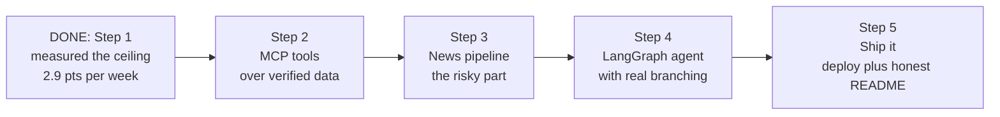
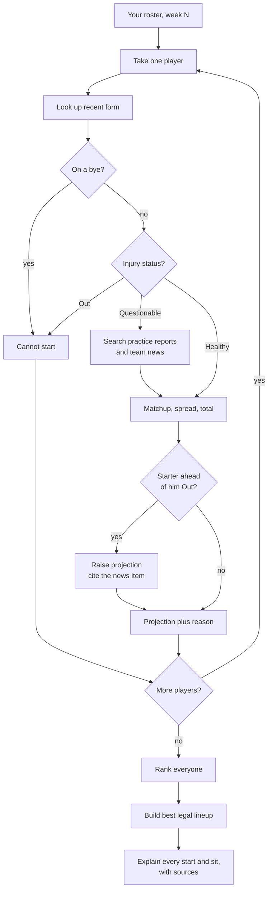
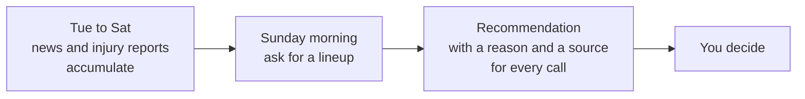
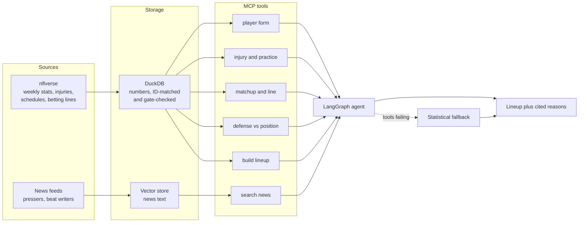

# Weekly Start/Sit Assistant — Build Plan

## What this is

A tool that pulls together everything relevant to your fantasy roster each week —
injuries, matchups, betting lines, recent form, team news — and recommends a lineup with a
reason for every call.

**It is not a claim that the picks are better than a simple rule.** We measured that, and
they mostly aren't. The value is that it does twenty minutes of tab-switching for you and
shows its work.

The point of the project is the engineering: a clean MCP server, an agent flow that
handles real branching and real failures, grounded output that cites its sources, and a
README honest enough to tell you what the thing is actually worth.

## What's already measured (Step 1, done)

Before building anything, we asked how much room a smarter start/sit tool could possibly
have. Twelve seasons, 144 team-seasons, point-in-time data only.

| Who sets the lineup | Points/season | Captured |
|---|---|---|
| Random | 1,521 | 85.1% |
| **Simple rule: season average, shrunk toward preseason rank** | **1,631** | **91.2%** |
| Cheater who knows every player's true ability | 1,671 | 93.4% |
| Cheater who also knows every matchup | 1,681 | 94.0% |
| Perfect hindsight | 1,789 | 100% |

**A cheater with perfect information beats a twelve-line rule by 49 points a season —
about 2.9 points a week out of roughly 96.** Forty percent of the weekly decision space is
irreducible luck. Detecting a realistic system's edge would take about 53 team-seasons;
one live season gives you one.

So no tool in this category, ours included, is going to meaningfully out-pick a simple
rule. That finding goes in the README rather than being quietly omitted, which is what
makes this stronger than the apps it's modelled on rather than weaker.

Everything below is therefore about building it well, not about proving it wins.

## Build order

### Step 2 — MCP tools over the data we already trust

MCP is a standard way to hand an AI a set of functions it can call. Six tools:

| Tool | Returns |
|---|---|
| `get_player_form` | last N games, per-game points, trend |
| `get_injury_report` | status plus practice participation through the week |
| `get_matchup` | opponent, spread, game total, home or away, roof |
| `get_defense_vs_position` | how generous that defense has been to this position |
| `get_bye_weeks` | who is off this week |
| `build_lineup` | best legal lineup given projections — already written |

All six sit on data that already passed its checks: 100% of 2,065 ADP rows resolve to real
player IDs, and every ADP window was verified to close before kickoff.

**What "good" means here:** typed schemas, an explicit error shape rather than a raised
exception, a `source` and `as_of` field on every response so the agent can cite it, and no
tool that silently returns empty when it should say "no data."

### Step 3 — The news pipeline (the risky part)

Everything in Step 2 is numbers, and numbers are what a spreadsheet already does well.
The only reason to involve an AI is the text:

- "the coach said Wednesday the rookie is getting more carries"
- "the cornerback covering him is out"
- "he has been limited in practice all week"

Pull it, chunk it, embed it, store it so the agent can search by meaning. A vector
database is the right tool here — and *only* here. Stats stay in SQL.

**What "good" means here:** every stored chunk keeps its URL and timestamp so a claim can
be traced. Feeds fail, so a dead source degrades to "no news found" and the agent says so
out loud instead of inventing something. Cache aggressively; never hammer a source.

### Step 4 — The LangGraph agent

Those branches are why this needs a graph rather than a fixed sequence of calls.
"Questionable" sends it to read news a healthy player never triggers, and learning the
starter ahead of someone is Out changes that player's value after the fact.

**What "good" means here:** the graph never dies on one bad tool call. A missing news
source produces a lower-confidence recommendation, not a stack trace. Every projection
carries the specific data or article behind it. And the fallback path is a plain
statistical recommendation, so the tool still works when the clever parts are down.

### Step 5 — Ship it

Deploy it, make it runnable by someone who is not you, and write the README described
below. The 2026 season starts September 9th, so you can actually use it yourself — not to
gather evidence, just because it is useful.

## How you'd use it each week

## How the pieces fit together

Everything in **Storage** exists and is checked except the vector store. That is the only
genuinely new plumbing.

## The README is the differentiator

Most tools in this space imply an edge they never measured. Ours states the opposite,
plainly, near the top:

> **What is this worth?**
> I backtested it. Across 12 seasons and 144 team-seasons, a cheater with perfect
> knowledge of player ability and matchup quality beats a twelve-line shrinkage rule by
> 49 points a season — about 2.9 points a week out of ~96. Roughly 40% of weekly variance
> is irreducible luck.
>
> So this will not meaningfully out-pick a simple rule, and neither will anything else in
> this category. What it does is assemble the information for you and show its sources.

Then the engineering-credibility section, which is real work worth showing:

- point-in-time discipline: every ADP window verified to close before Week 1 kickoff, 12/12
- 100% ID resolution across 2,065 player-seasons
- 81 name collisions caught and fixed, including a father and son with the same name whose
  stats were being swapped
- 6 nickname mappings derived from roster evidence rather than guesswork

## What could go wrong

**The news pipeline is fragile.** Sites change, feeds die. Build for graceful failure from
the first line, not as a later hardening pass.

**The agent sounds confident while being wrong.** This is the real risk of the whole
design. Mitigation is non-negotiable: every claim cites a source, and "I could not find
anything" is a valid, visible answer.

**Scope creep back toward proving it works.** It doesn't beat a simple rule. That is
settled, it is in the README, and it is not worth re-litigating with more compute.

## Rough time

| Step | Time |
|---|---|
| 2. MCP tools | 1–2 days |
| 3. News pipeline | 2–3 days *(the risky one)* |
| 4. LangGraph agent | 2 days |
| 5. Deploy plus README | 1 day |

About a week. Step 1 is done, and Step 5 replaced four months of waiting with a paragraph.

## Start here

**Step 2.** The data is verified and the lineup builder already exists, so the first tool
is mostly wiring.
